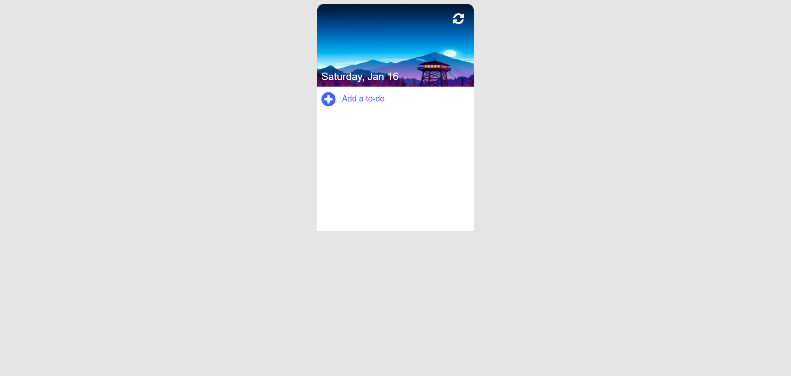

 

  

  <h3 align="center">Muust</h3>

  

    A simplistic to-do list, made in TypeScript.
     
     
    <a href="https://github.com/ShaanCoding/Muust"><strong>Explore the docs »</strong></a>
     
     
    <a href="https://muust.shaankhan.dev/">View Demo</a>
    .
    <a href="https://github.com/ShaanCoding/Muust/issues">Report Bug</a>
    .
    <a href="https://github.com/ShaanCoding/Muust/issues">Request Feature</a>
  

   

## Table Of Contents

- [Table Of Contents](#table-of-contents)
- [About The Project](#about-the-project)
- [Built With](#built-with)
- [Roadmap](#roadmap)
- [Contributing](#contributing)
  - [Creating A Pull Request](#creating-a-pull-request)
- [License](#license)
- [Authors](#authors)
- [Acknowledgements](#acknowledgements)

## About The Project

This project was based off a quick javascript tutorial on how to make a to-do list. This has been slightly adapted to be implemented in typescript and was made in order to attempt to learn javascript / typescript better myself.

## Built With

This application was built with love with the following tools / libraries:
TypeScript / JavaScript, HTML, CSS

* [Font Awesome](https://fontawesome.com/)

## Roadmap

See the [open issues](https://github.com/ShaanCoding/Muust/issues) for a list of proposed features (and known issues).

## Contributing

Contributions are what make the open source community such an amazing place to be learn, inspire, and create. Any contributions you make are **greatly appreciated**.
* If you have suggestions for adding or removing projects, feel free to [open an issue](https://github.com/ShaanCoding/Muust/issues/new) to discuss it, or directly create a pull request after you edit the *README.md* file with necessary changes.
* Please make sure you check your spelling and grammar.
* Create individual PR for each suggestion.
* Please also read through the [Code Of Conduct](https://github.com/ShaanCoding/Muust/blob/main/CODE_OF_CONDUCT.md) before posting your first idea as well.

### Creating A Pull Request

1. Fork the Project
2. Create your Feature Branch (`git checkout -b feature/AmazingFeature`)
3. Commit your Changes (`git commit -m 'Add some AmazingFeature'`)
4. Push to the Branch (`git push origin feature/AmazingFeature`)
5. Open a Pull Request

## License

Distributed under the MPL-2.0 License. See [LICENSE](https://github.com/ShaanCoding/Muust/blob/main/LICENSE.md) for more information.

## Authors

* **Shaan Khan** - *Comp Sci Student* - [Shaan Khan](https://github.com/ShaanCoding/) - *Wrote the code for this project*
* **Code Explained** - *Youtuber* - [Code Explained](https://www.youtube.com/watch?v=b8sUhU_eq3g) - *Created the entire tutorial this repo follows*

## Acknowledgements

* [ShaanCoding](https://github.com/ShaanCoding/)
* [Othneil Drew](https://github.com/othneildrew/Best-README-Template)
* [ImgShields](https://shields.io/)
